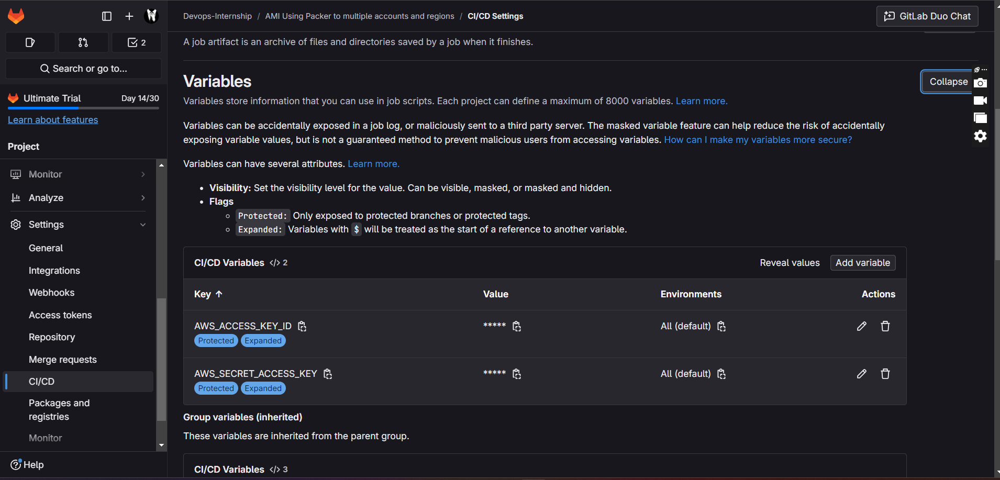
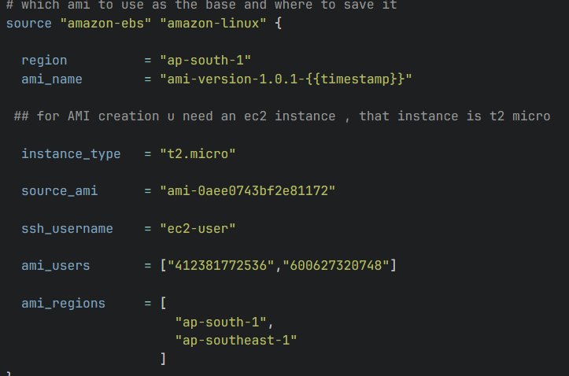

# Packer AMI Build and Deployment with GitHub Actions 
This repository demonstrates how to build Amazon Machine Images (AMIs) using Packer and deploy them across multiple AWS accounts and regions using GitHUb Actions.

## Step 1: Add AWS Credentials

1. Go to your GitHub repository settings.
2. Navigate to **Settings > Secrets and variables > Actions.**
3. Click on **New repository secret** and add the following secrets: ( AWS_ACCESS_KEY_ID and AWS_SECRET_ACCESS_KEY_ID)
4. Ensure these secrets are available in your GitHub Actions workflow.

## Step 2: Configure Accounts and Regions

1. Update your configuration files to include the AWS accounts and regions where you want to deploy the AMIs.
2. Customize the AWS regions and accounts according to your requirements.

## Step 3: Run the GitHub Actions Workflow

1. Push changes to the repository or manually trigger the workflow.
2. The workflow will build the AMIs using Packer and distribute them across the specified regions and accounts.
3. Note that the workflow may take up to 15 minutes to complete the distribution process.

## Additional Information

- Ensure that your GitHUb Actions runners have the necessary permissions to access AWS resources.
- Review Packer and GitHub Actions documentation for more details on configuration and usage.
